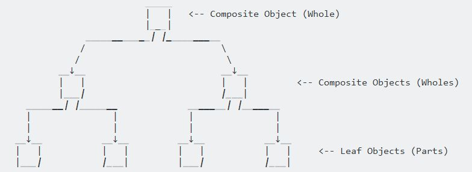

<h1 align="center">
	<a href="https://github.com/KeyC0de/CompositePattern">Composite Pattern</a>
</h1>

Here we decipher the obscure Composite Pattern hieroglyphics.

**Definition**: Compose objects into tree structures to represent part-whole hierarchies.

The Composite pattern enables us to iterate over objects or collection of those objects in a uniform manner, without having to typecheck or differentiate between the concrete objects and their collections. All those objects share a common interface (base class/interface).

The whole point of the Composite pattern is that the Composite can be treated atomically as if it was a leaf object, without needing to know that there are many objects inside.
Leaf objects perform a request directly, and Composite objects forward the request to their child components recursively downwards the tree structure. This makes client classes easier to implement, change, test, and reuse.

- Define a unified Component interface for both part (Leaf) objects and whole (Composite) objects.
- Individual Leaf objects implement the Component interface directly, and Composite objects forward requests to their child components.

	

**Design**

1. Identify the scalar/primitive classes and vector/container classes
2. Create an interface which will be used to inherit from concrete/leaf classes and make their use interchangeable
4. All container classes couple themselves to the interface (recursive composition, Composite 'has a' set of children up the 'is a' hierarchy)
5. Container classes use polymorphism as they delegate requests to their children

Some implementations also provide an iterator protocol to traverse the tree, but this is not necessary At.All .com.

# Contribute

Please submit any bugs you find through GitHub repository 'Issues' page with details describing how to replicate the problem. If you liked it or you learned something new give it a star, clone it, contribute to it whatever. Enjoy.

# License

Distributed under the GNU GPL V3 License. See "GNU GPL license.txt" for more information.

# Contact

email: *nik.lazkey@gmail.com* 
website: *www.keyc0de.net*

